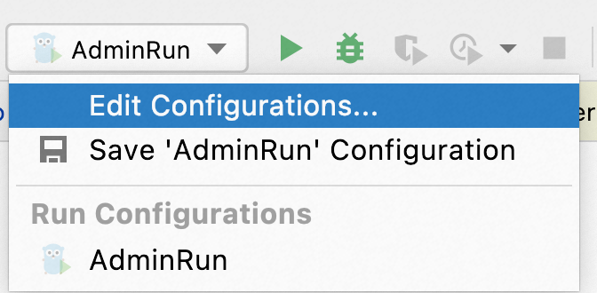

# NOTICE
此分支是 Dubbo Admin 正在基于 Go 语言重构的开发分支，目前仍在开发过程中。
如您正寻求将 Dubbo Admin 用作生产环境，想了解 Admin 的能力及安装方式，请参见 [develop 分支](https://github.com/apache/dubbo-admin/tree/develop#dubbo-admin) 及内部相关使用说明。

# 运行 Admin
## 启动 Zookeeper
首先，你需要在本地启动一个 [zookeeper server](https://zookeeper.apache.org/doc/current/zookeeperStarted.html)，用作 Admin 连接的注册/配置中心。

## 启动 Admin

### Run with IDE
Once open this project in GoLand, a pre-configured Admin runnable task can be found from "Run Configuration" pop up menu as shown below.



Click the `Run` button and you can get the Admin process started locally.

> But before doing that, you might need to change the configuration file located at `/conf/dubboadmin.yml` to make sure `registry.address` is pointed to the zookeeper server you started before.

```yaml
admin:
  registry:
    address: zookeeper://127.0.0.1:2181
  config-center: zookeeper://127.0.0.1:2181
  metadata-report:
    address: zookeeper://127.0.0.1:2181
```

### Run with command line

```shell
$ export ADMIN_CONFIG_PATH=/path/to/your/admin/project/conf/admin.yml
$ cd cmd/admin
$ go run . 
```

Open the browser and visit http://localhost:38080/admin/ to open the console.

> If you also have the Java version admin running, make sure to use different port to avoid conflict.

### 一些 Dubbo 客户端示例
为了能在 Admin 控制台看到一些示例数据，可以在本地启动一些示例项目。可参考以下两个链接，务必确保示例使用的注册中心指向你之前启动的 zookeeper server，如果示例中有使用 embeded zookeeper 则应该进行修改并指向你本地起的 zookeeper 集群。

1. https://github.com/apache/dubbo-samples/tree/master/1-basic/dubbo-samples-spring-boot
2. https://dubbo.apache.org/zh-cn/overview/quickstart/java/brief/

## 前端开发步骤
项目完整前端代码存放在：`[dubbo-admin-ui](./dubbo-admin-ui/README.md)`。

## 贡献代码
开发过程中，可以使用预先定义好的 Makefile 任务来完成代码检查、测试等一系列工作。以下是一些命令说明

### 代码格式化
```shell
make fmt   #Run gofumpt against code.
```

### 代码检查
To run all code formatting, linting and vetting tools use the target:

```shell
make lint     #Run golang lint against code
```

### 测试代码

```shell
make test             #Run all tests
make test-dubboctl    #Run tests for dubboctl
make test-admin       #Run tests for admin
make test-authority   #Run tests for authority
```

### Swagger API
```shell
make swagger  #Generate dubbo-admin swagger docs in hack/swagger
```

### 打包
```shell
make build            #Build binary with the dubbo admin, authority, and dubboctl
make build-admin      #Build binary with the dubbo admin.
make build-authority  #Build binary with the dubbo authority.
make build-dubboctl   #Build binary with the dubbo dubboctl.
make build-ui         #Build the distribution of the admin ui pages.
```
### 生成镜像
```shell
make image            #Build docker image with the dubbo admin, authority and admin-ui
make image-admin      #Build docker image with the dubbo admin.
make image-authority  #Build docker image with the dubbo authority.
make image-ui         #Build docker image with the dubbo admin ui.
```
### 多平台生成镜像和打包
```shell
make buildx            #Build and push docker cross-platform image for the dubbo admin and authority
make buildx-admin      #Build and push docker image with the dubbo admin for cross-platform support
make buildx-authority  #Build and push docker image with the dubbo authority for cross-platform support
make buildx-dubboctl   #Build the dubboctl distribution for cross-platform support
```

## 发布指南
正式发布的一些 make 命令...
