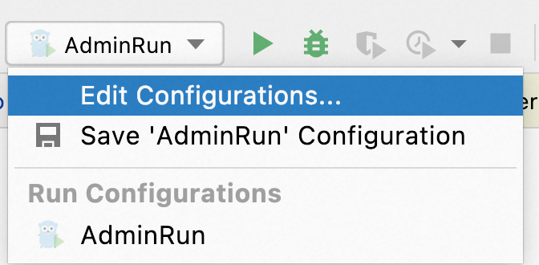

# NOTICE
此分支是 Dubbo Admin 正在基于 Go 语言重构的开发分支，目前仍在开发过程中。
如您正寻求将 Dubbo Admin 用作生产环境，想了解 Admin 的能力及安装方式，请参见 [develop 分支](https://github.com/apache/dubbo-admin/tree/develop#dubbo-admin) 及内部相关使用说明。

# 运行 Admin
## 启动 Zookeeper
首先，你需要在本地启动一个 [zookeeper server](https://zookeeper.apache.org/doc/current/zookeeperStarted.html)，用作 Admin 连接的注册/配置中心。

## 启动 Admin

### Run with IDE
Once open this project in GoLand, a pre-configured Admin runnable task can be found from "Run Configuration" pop up menu as shown below.



Click the `Run` button and you can get the Admin process started locally.

> But before doing that, you might need to change the configuration file located at `/conf/dubboadmin.yml` to make sure `registry.address` is pointed to the zookeeper server you started before.
```yaml
admin:
  registry:
    address: zookeeper://127.0.0.1:2181
  config-center: zookeeper://127.0.0.1:2181
  metadata-report:
    address: zookeeper://127.0.0.1:2181
```

### Run with command line
```shell
$ export ADMIN_CONFIG_PATH=/path/to/your/admin/project/conf/admin.yml
$ cd cmd/admin
$ go run . 
```

Open the browser and visit http://localhost:38080/admin/ to open the console.

> If you also have the Java version admin running, make sure to use different port to avoid conflict.

### 一些 Dubbo 客户端示例
为了能在 Admin 控制台看到一些示例数据，可以在本地启动一些示例项目。可参考以下两个链接，务必确保示例使用的注册中心指向你之前启动的 zookeeper server，如果示例中有使用 embeded zookeeper 则应该进行修改并指向你本地起的 zookeeper 集群。

1. https://github.com/apache/dubbo-samples/tree/master/1-basic/dubbo-samples-spring-boot
2. https://dubbo.apache.org/zh-cn/overview/quickstart/java/brief/

## 前端开发步骤

前端开发步骤...

### 前后端打包
如果你有修改前端代码，则按照以下方式重新打包前端代码后，重新启动 Admin 进程。

## 贡献代码
开发过程中，可以使用预先定义好的 Makefile 任务来完成代码检查、测试等一系列工作。以下是一些命令说明

### 代码检查
To run all code formatting, linting and vetting tools use the target:

```shell
make check
```

### 测试代码
For all tests, run:

```shell
make test
```

And you can run tests that are specific to a part of Admin by appending the app name as shown below:

```shell
make test/dubboctl
```

### Swagger API
```shell
make swagger
```

### 打包
To build all the binaries run:

```shell
make build
```

Like `make test`, you can append the app name to the target to build a specific binary. For example, here is how you would build the binary for only dubboctl:

```shell
make build/dubboctl
```

## 发布指南
正式发布的一些 make 命令
