# Dubbo Admin AI Architecture

## 1. 组件设计模式

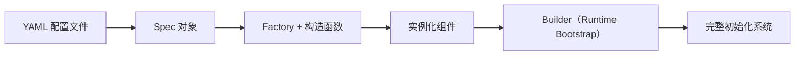

1. 配置映射模式：将 YAML 配置映射为 `Spec` 对象，解耦配置表达与运行时实现。
2. 工厂模式：Runtime 按组件 `type` 选择 `Factory`，通过构造函数创建具体组件实例。
3. 构建器模式：Runtime `Bootstrap` 统一编排创建、`Init`、`Start`，完成系统装配。
4. 生命周期模板模式：组件统一遵循 `Init/Start/Stop`，保证启动与停机流程一致。

## 2. 系统总体架构

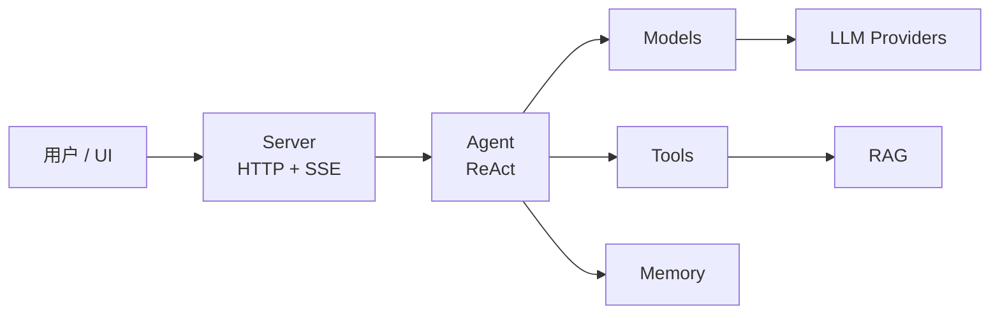

核心数据流：
1. 请求从 UI 进入 Server。
2. Server 将输入与 session 交给 Agent。
3. Agent 在 ReAct 循环中调用 Models/Tools，必要时触发 RAG。
4. Agent 产出中间与最终结果，Server 以 SSE 流式回传。

## 3. 核心模块与职责

### 3.1 Runtime 组件架构

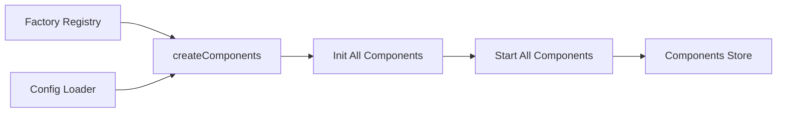

要点：
- Runtime 是组件容器与装配中心，负责工厂注册、配置驱动实例化、生命周期编排。
- 组件创建顺序由工厂注册顺序决定，是全局依赖约束的落地点。
- Runtime 只负责装配与调度，不承载业务推理逻辑。

### 3.2 Agent 组件架构

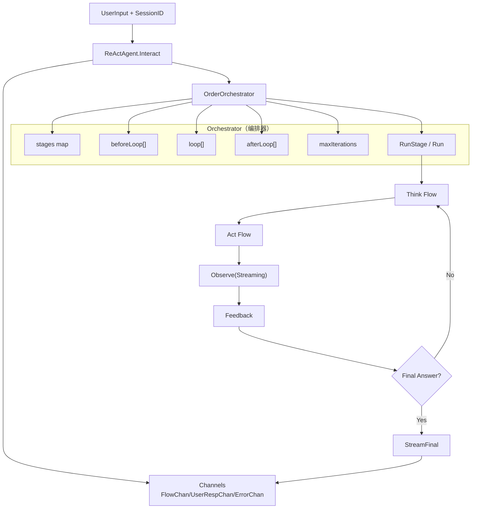

要点：
- Agent 通过 `OrderOrchestrator` 执行阶段编排，核心是 `stages map + before/loop/after + maxIterations`。
- 阶段顺序由配置构建，编排器按顺序执行并在循环中判断是否收敛到 `Final Answer`。
- `Observe` 阶段为流式阶段，编排器通过 `Channels` 将增量输出和最终结果回传给 Server。

### 3.3 Models 组件架构

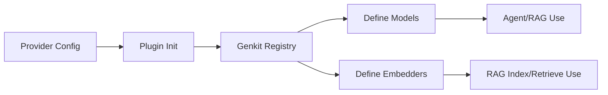

要点：
- Models 负责统一 Provider 适配，并注册模型与向量化能力。
- 上层只依赖统一模型抽象，避免直接耦合 Provider 差异。
- 新增 Provider 优先通过插件注册完成，减少业务层改动。

### 3.4 Tools 组件架构

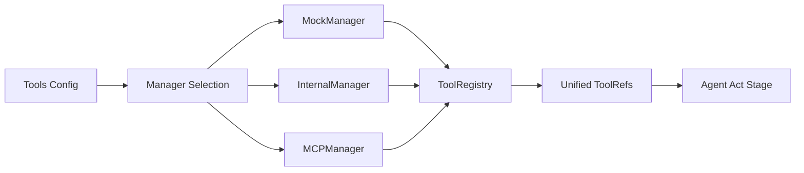

要点：
- Tools 是工具聚合层，向上屏蔽不同工具来源差异。
- 通过配置可按环境开启/关闭不同 manager，支持渐进接入。
- Tool 调用结果统一为结构化输出，降低 Agent 处理复杂度。

### 3.5 RAG 组件架构

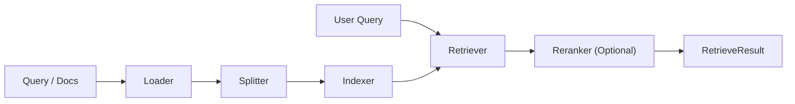

要点：
- RAG 采用子组件链式组合，支持索引与检索路径独立演进。
- Reranker 为可选能力，允许按成本/效果权衡启用。
- RAG 作为能力组件被工具或命令链路复用，不直接耦合 Server。

### 3.6 Memory 组件架构

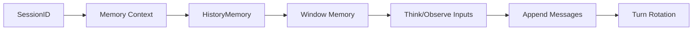

要点：
- Memory 负责按会话管理历史上下文，是多轮推理一致性的基础。
- 通过窗口化历史控制上下文规模，平衡效果与成本。
- 会话删除时可联动清理历史，避免状态残留。

### 3.7 Server 组件架构

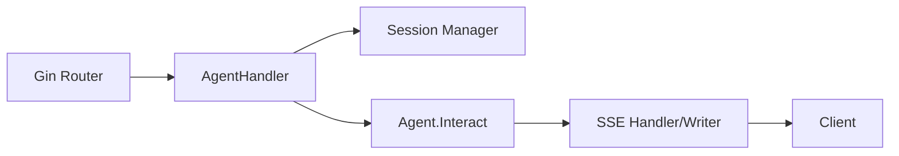

要点：
- Server 提供统一入口（HTTP + SSE），并隔离会话管理、错误恢复、流式写回。
- Server 只负责编排请求生命周期，不承担模型/工具决策。
- 面向 Agent 暴露最小依赖，保持入口层轻量。

## 4. 模块依赖关系

### 4.1 组件生命周期

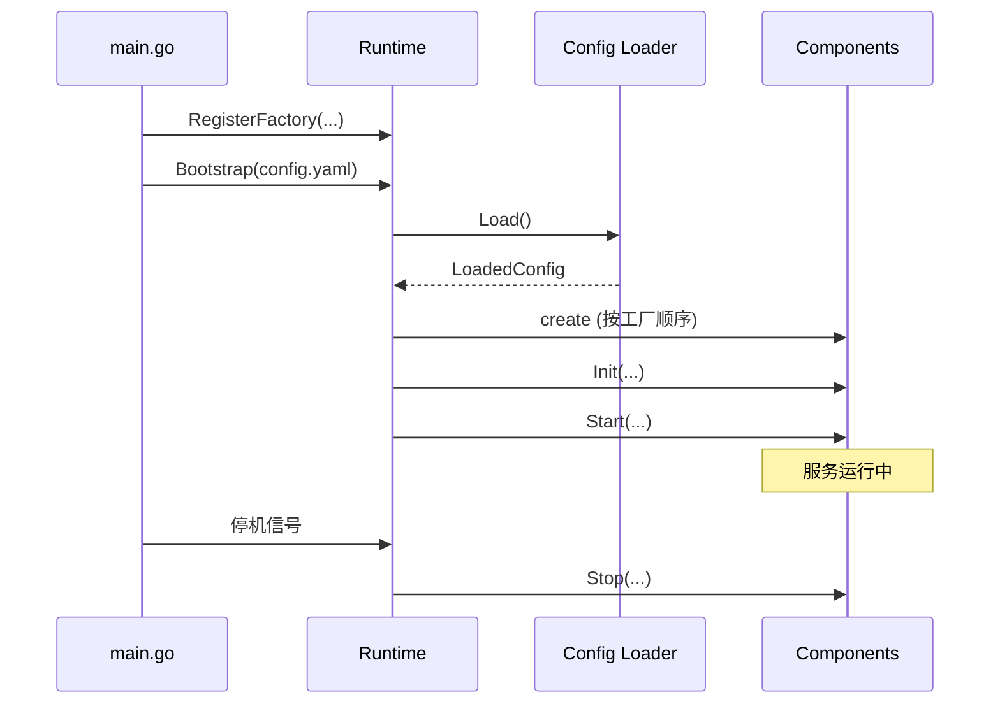

要点：
- 生命周期统一到 Runtime，业务组件不自行管理全局启动流程。
- 初始化失败应尽早暴露（fail-fast），避免半启动状态。

### 4.2 组件化设计如何体现

- 统一接口边界：所有核心模块遵循相同生命周期契约（`Name/Init/Start/Stop`）。
- 装配与实现解耦：Runtime 通过工厂 + 配置决定实例，模块间不直接绑定具体构造过程。
- 显式依赖获取：组件在 `Init` 中通过 Runtime 获取依赖，便于检查与测试。
- 局部替换能力：Provider、ToolManager、RAG 子组件可替换，上层编排逻辑保持稳定。
- 组件内再组件化：RAG 内部继续拆分子组件，支持分层演进而非大类重写。

## 5. 关键交互链路

### 5.1 聊天请求主链路

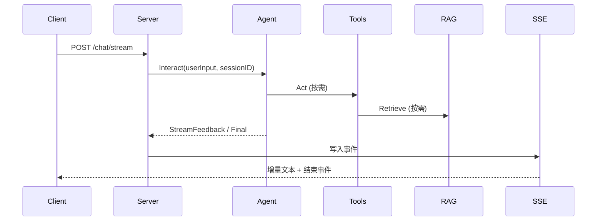

要点：
- 主链路强调“编排与协作”，不是接口字段细节。
- SSE 让用户在长链路推理时持续获得反馈。

### 5.2 ReAct 阶段协作

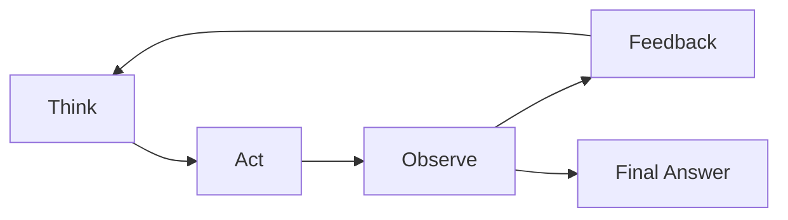

阶段说明：
- Think：识别意图、分析上下文、决定是否需要工具。
- Act：执行工具请求并收集结构化结果。
- Observe：融合推理与工具输出形成判断。
- Feedback：将结果转换为可流式输出的用户可读内容。

## 6. 设计原则

原则说明：
- 组件化边界：模块只暴露必要能力，降低跨模块渗透。
- 配置驱动：优先通过配置变更能力而非修改核心代码。
- 显式依赖：依赖关系可见、可校验、可测试。
- 可替换性：面向接口编排，降低底层实现演进成本。
- Fail-fast + 可观测：尽快暴露错误，便于定位与恢复。

## 7. 关键权衡（Trade-offs）

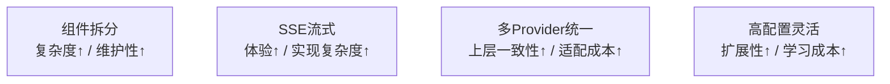

权衡说明：
- 本架构接受一定实现复杂度，以换取长期维护收益。
- 对外保持统一抽象，对内承受适配和治理成本。

## 8. 关联文档

- `docs/user-guide/getting-started.md`
- `docs/user-guide/configuration.md`
- `docs/developer/creating-components.md`
- `docs/developer/contributing.md`
- `docs/proposals/roadmap.md`
