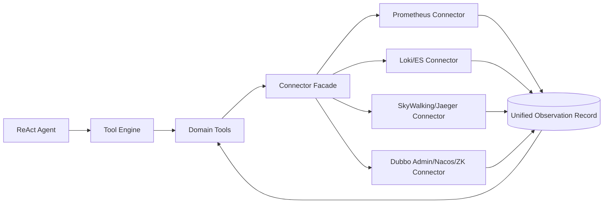

提案标题：为 Dubbo Admin AI Agent 建立生产可用的数据源适配层（Connector Layer）

提案编号: 0001

作者: liwener / Codex

状态: 草案 (Draft)

提交日期: 2026-03-01

关联 Issue: 待补充

1. 摘要 (Summary)

当前 AI Agent 的数据面工具以 mock 实现为主，无法基于真实线上指标、日志、链路和注册中心状态完成可追溯诊断。本提案建议先建设统一 Connector 适配层与统一数据协议（时间窗、标签、来源、可信度），再分阶段接入 Prometheus、Loki/Elasticsearch、SkyWalking/Jaeger、Dubbo Admin/Nacos/Zookeeper，实现从“原型演示”到“生产可用”的演进。

2. 动机 (Motivation)

当前系统存在以下核心问题：

- 默认配置启用 mock 工具：`component/tools/tools.yaml:3` 为 `enable_mock_tools: true`。
- 工具主注册集来自 `NewMockToolManager`，包括 metric/log/trace/dubbo 等：`component/tools/engine/mock_tools.go:643-655`。
- 关键工具返回固定数据而非真实查询结果：
- 指标：`prometheusQueryServiceTraffic` 直接返回 `250.0 QPS / 5.2%`（`component/tools/engine/mock_tools.go:74-79`）。
- 链路：`traceLatencyAnalysis` 直接返回 `3200ms` 与固定瓶颈（`component/tools/engine/mock_tools.go:300-316`）。
- Dubbo 状态：固定 provider/consumer IP（`component/tools/engine/mock_tools.go:460-471`）。
- 日志：固定命中数和固定时间戳样例（`component/tools/engine/mock_tools.go:509-525`）。

业务影响：

- 根因分析不可验证，诊断结论缺乏真实性与可追溯性。
- 无法进行跨数据源关联（指标异常 -> 日志证据 -> 链路瓶颈 -> Dubbo 治理状态）。
- 现有 `api/v1/ai` 对话接口只能调用工具链，但工具数据本身不具备生产可信度（`component/server/engine/router.go:35-45`）。

如果不做该改动：AI Agent 仍将停留在 PoC，无法用于真实故障排查与恢复建议闭环。

3. 详细设计 (Detailed Design)

3.1 设计目标

- 提供统一、可扩展的数据源接入层，替换 mock-only 数据面。
- 统一返回结构，支持多源融合推理。
- 保留向后兼容：在无外部依赖场景继续可运行。

3.2 架构变更

在 `tools` 组件内部新增“连接器层 + 统一协议层 + 真实工具层”：



建议新增模块（路径建议）：

- `component/tools/engine/connectors/`：各数据源客户端与查询适配。
- `component/tools/engine/protocol/`：统一数据协议定义。
- `component/tools/engine/real_tools.go`：生产工具注册与实现。
- `component/tools/config.go`：扩展 connector 配置（endpoint、鉴权、超时、降级策略）。

3.3 统一数据协议（核心）

定义统一观测记录 `ObservationRecord`，确保跨源可合并、可排序、可解释：

```go
// 示例接口（伪代码）
type ObservationRecord struct {
    SignalType   string            `json:"signal_type"`   // metric|log|trace|registry
    Service      string            `json:"service"`
    Instance     string            `json:"instance,omitempty"`
    TimestampMs  int64             `json:"timestamp_ms"`
    Window       TimeWindow        `json:"window"`        // 起止时间
    Labels       map[string]string `json:"labels,omitempty"`
    Value        any               `json:"value"`         // 数值、日志行、span摘要、节点状态
    Source       DataSourceMeta    `json:"source"`        // 来源系统、查询语句、链接
    Confidence   float64           `json:"confidence"`    // 0~1
}

type TimeWindow struct {
    StartMs int64 `json:"start_ms"`
    EndMs   int64 `json:"end_ms"`
}

type DataSourceMeta struct {
    System       string `json:"system"`        // prometheus|loki|es|jaeger|skywalking|dubbo-admin|nacos|zk
    Query        string `json:"query"`
    RetrievedAt  int64  `json:"retrieved_at"`
    Traceability string `json:"traceability"`  // 可选：URL/ID/检索指纹
}
```

协议约束：

- 所有工具必须显式带时间窗；禁止“无限时间范围”。
- 每条证据必须标注来源系统与检索表达式。
- 置信度由连接器按规则生成（例如采样完整度、返回条数、时间覆盖率）。

3.4 工具分层与分期落地

Phase 0（先决条件，最高优先级）

- 完成协议、连接器接口、配置模型。
- 交付 `RealToolManager`，与 `MockToolManager` 并存。
- 配置开关支持三态：`mock_only`、`hybrid`、`real_only`。

Phase 1（高优先级，先打通读路径）

- Prometheus Connector：QPS、RT、错误率、实例对比。
- Dubbo Admin + Nacos/ZK Connector：服务实例、提供者/消费者、注册状态。
- 工具优先实现只读诊断，不做写操作。

Phase 2（中优先级，补齐证据维度）

- Loki/ES Connector：日志检索、错误聚合、关联 traceId。
- SkyWalking/Jaeger Connector：调用拓扑、慢调用、异常 span。
- 新增跨源关联工具：同时间窗内 metric/log/trace 聚合。

Phase 3（低优先级，智能诊断与恢复建议）

- `diagnose_service_issues`：统一证据推理。
- `generate_recovery_plan`：生成带风险等级的恢复方案。
- 执行类能力仅在明确授权和 guardrail 下开放。

3.5 API 变更策略

当前代码中对外仅有 `POST /api/v1/ai/chat/stream` 等 AI 会话接口（`component/server/engine/router.go:35-45`）。

因此本提案建议：

- 第一阶段不强依赖新增 HTTP API；优先在 tool engine 内完成真实连接器接入。
- 如需对外开放观测查询能力，新增聚合 API（可选），而非一开始铺开大量细粒度端点。
- 你初稿中的 `/api/v1/metrics/*`、`/api/v1/logs/*`、`/api/v1/traces/*` 可以作为二期网关化选项。

3.6 异常与边界处理

- 数据源不可达：返回结构化错误 + 降级到可用源（hybrid 模式）。
- 查询超时：统一超时控制（连接器级 + 工具级），避免阻塞 ReAct 回合。
- 标签缺失/高基数：连接器做白名单过滤，防止 PromQL/Loki 查询爆炸。
- 空结果：保留空数据但附来源与置信度，不将“无数据”误判为“无异常”。
- 时间偏移：统一使用 UTC 毫秒时间戳并在响应中回显 window。

3.7 验收标准（Definition of Done）

- 在 `real_only` 模式下，关键工具不再依赖 `mock_tools.go` 的固定数据。
- 至少打通四类真实数据源中的两类（建议 Prometheus + Dubbo Admin）并通过集成测试。
- 每个工具响应必须包含 `window + source + confidence` 三要素。
- 提供故障注入测试：数据源超时、鉴权失败、部分源不可用。

4. 缺点与权衡 (Drawbacks & Trade-offs)

- 系统复杂度上升：新增连接器、鉴权、重试、缓存与熔断逻辑。
- 运维成本上升：需要管理多数据源访问凭据和网络连通性。
- 推理耗时可能增加：多源查询会拉长单次诊断时延。

为何仍值得做：

- 这是 AI Agent 从“演示”到“生产可用”的关键跨越；没有真实数据，后续智能诊断功能价值有限。

5. 替代方案 (Alternatives)

方案 A：继续扩展 mock 数据复杂度

- 优点：开发快、无外部依赖。
- 缺点：无法解决真实性和可追溯性问题，生产价值不足。

方案 B：全部走 MCP 工具，不在本仓库实现连接器

- 优点：实现快、复用外部生态。
- 缺点：当前配置默认禁用 MCP（`component/tools/tools.yaml:5`），且外部工具契约难以统一治理。

方案 C：先新增大量 `/api/v1/metrics|logs|traces` HTTP 接口，再接入工具层

- 优点：接口边界清晰。
- 缺点：在当前仅有 AI 对话 API 的阶段会造成过早扩展面，交付周期长。

最终选择：先工具层连接器化（低耦合、高收益），再视需要外露聚合 API。

6. 采用与兼容性策略 (Adoption Strategy)

- 非破坏性演进：保留 mock 与 internal tools，新增 real tool manager。
- 配置迁移：
- 新增 `connector_mode`（`mock_only|hybrid|real_only`）。
- 新增各连接器配置块（endpoint、auth、timeout、retry）。
- 默认建议：开发环境 `hybrid`，预发/生产 `real_only`。
- 迁移步骤：
- 第一步：部署 Prometheus + Dubbo Admin 连接器并验证只读工具。
- 第二步：接入日志/链路连接器，开启跨源关联工具。
- 第三步：逐步关闭 mock-only 路径，保留应急回退开关。

7. 未决问题 (Unresolved Questions)

[ ] 问题 1：统一协议中的 `confidence` 评分模型如何标准化，是否需要按信号类型定制？

[ ] 问题 2：日志源优先 Loki 还是 Elasticsearch，是否需要双栈并存策略？

[ ] 问题 3：执行类恢复工具（变更路由/配置）的授权模型与审计链路如何设计？

[ ] 问题 4：是否在二期引入统一观测聚合 API，还是维持“仅 Agent 工具调用”模式？
