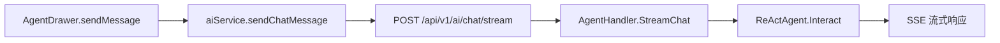
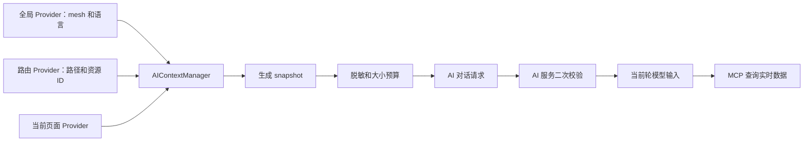

# AI 页面上下文管理设计

## 1. 背景

当前 Dubbo Admin AI 弹窗只发送用户最新输入和会话 ID。AI 不知道用户正在浏览哪个页面、当前选择了哪个 mesh 或资源，也不知道页面上是否存在尚未保存的配置。

旧实验分支 `origin/feat/context-ai` 引入了全局响应式上下文，并在多个页面构造摘要。这项工作验证了页面上下文的价值，但尚未接入 AI 请求，同时存在生命周期、安全、数据规模和维护成本方面的问题。

本设计遵循一个核心原则：

> 优先传递稳定的资源引用，仅在发送消息时生成上下文快照，并通过 MCP 工具查询权威的实时数据。

## 2. 目标

- 让 AI 理解用户当前所在页面及其指向的资源。
- 支持“这个应用”“当前服务”“这个实例”等指代。
- 支持后端无法查询的 UI 状态，例如筛选条件、选中项和未保存表单。
- 上下文只属于当前活动页面，避免跨路由残留旧数据。
- 对字段、敏感信息和请求体大小进行统一约束。
- 降低页面接入成本，避免页面与 AI 弹窗直接耦合。
- 页面快照与实时数据冲突时，以 MCP 查询结果为准。

## 3. 非目标

- 不把所有 API 响应复制进全局 Store。
- 不通过抓取 DOM 推断页面状态。
- 不把页面上下文持久化到 localStorage 或持久化 Pinia Store。
- 不把页面内容直接拼进模型的 system prompt。
- 不使用页面上下文替代对话历史或 MCP 工具。
- 第一阶段不要求覆盖所有页面。

## 4. 当前调用链



当前请求体如下：

```json
{
  "message": "这个应用为什么没有实例？",
  "sessionID": "session_xxx"
}
```

前端的消息数组仅用于渲染，不会随每次请求一起发送。

## 5. 旧方案问题

### 5.1 没有接入 AI 请求

旧分支定义了 `getContext()`，但 `AgentDrawer` 和 `ai.ts` 都没有调用它。页面虽然收集了上下文，AI 服务实际并未收到。

### 5.2 敏感信息暴露

旧实现收集 registry、metadata、Prometheus、Grafana、实例 IP、镜像、节点、Label 和配置等原始数据，但没有过滤密码、Token、认证请求头或 URL 中的用户信息。

### 5.3 旧页面数据可能写入新页面

页面状态存放在一个全局可变的响应式对象中。路由切换虽然会清空对象，但旧页面的异步请求可能在切换完成后返回，并把旧数据重新写进新页面上下文。

### 5.4 请求体没有上限

列表页面同时保存原始行数据和每一行生成的文本摘要，没有条数限制、字节限制、Token 估算或按优先级截断机制。

### 5.5 页面耦合严重

大量 View 手工调用页面专属 Builder。接口字段变化、新增 Tab 或新增页面时，很容易遗漏上下文更新，而且错误不会被自动发现。

### 5.6 缺少新鲜度和来源

上下文没有记录采集时间、数据来源以及加载、成功、缓存或失败状态。AI 无法判断数据是否仍然有效。

## 6. 推荐架构

采用 Provider 注册机制，并在发送消息时生成快照。



### 6.1 Provider 注册机制

页面注册一个返回当前结构化上下文的函数。组件卸载时自动注销 Provider。

```ts
interface AIContextProvider {
  id: string
  priority?: number
  routeKey?: () => string | undefined
  collect: () => AIContextContribution | undefined
}
```

Manager 不持续复制页面状态。只有用户发送消息时，才执行当前仍然有效的 Provider。
页面通过 `useAIContextProvider` 注册时，Composable 会自动绑定当前路由并在组件停用或卸载时注销，页面无需自行设置 `routeKey`。

### 6.2 上下文来源

上下文分成四层：

1. 全局上下文：当前 mesh 和语言。
2. 路由上下文：路由名称、路径、参数、查询参数和活动 Tab。
3. 资源范围：应用、服务、实例、规则等稳定标识。
4. 页面状态和证据：筛选、选中项、未保存修改和少量摘要。

当前 mesh 必须直接读取 `useMeshStore()`，上下文 Manager 不重复持久化它。

### 6.3 引用优先

前端应优先发送稳定资源标识：

```json
{
  "mesh": "nacos2.5",
  "application": "shop-user"
}
```

AI 使用这些标识调用 MCP，查询最新实例、服务、指标或配置。只有 MCP 无法获取的信息，或能帮助解释用户当前视图的摘要，才作为页面证据发送。

## 7. 数据契约

```ts
export interface AIContextSnapshot {
  version: 1
  capturedAt: string
  global: {
    locale?: string
  }
  page: {
    routeName?: string
    path: string
    fullPath?: string
    activeTab?: string
    params?: Record<string, unknown>
    query?: Record<string, unknown>
  }
  scope: {
    mesh: string
    application?: string
    service?: string
    instance?: string
    rule?: string
  }
  state?: {
    filters?: Record<string, unknown>
    selection?: Record<string, unknown>
    unsavedChanges?: Record<string, unknown>
  }
  evidence?: AIContextSection[]
  truncation?: {
    truncated: boolean
    omittedSections: string[]
  }
}

export interface AIContextContribution {
  scope?: Partial<AIContextSnapshot['scope']>
  state?: AIContextSnapshot['state']
  evidence?: AIContextSection | AIContextSection[]
}

export interface AIContextSection {
  id: string
  source: string
  capturedAt?: string
  priority?: number
  data: Record<string, unknown>
}
```

数据契约必须包含版本号，使前端和 AI 服务能够独立演进。Provider 可以省略 `capturedAt` 和 Section 的 `priority`，生成快照时会分别使用当前采集时间和 Provider 优先级补齐。

## 8. 前端模块设计

建议目录：

```text
ui-vue3/src/ai-context/
  types.ts
  manager.ts
  snapshot.ts
  sanitize.ts
  providers/
    global.ts
    route.ts
  composables/
    useAIContextProvider.ts
```

页面注册示例：

```ts
useAIContextProvider({
  id: 'application-detail',
  priority: 100,
  collect: () => ({
    scope: {
      application: String(route.params.name)
    },
    evidence: {
      id: 'application-summary',
      source: 'application-detail-api',
      data: {
        instanceCount: detail.value?.instanceCount,
        serviceCount: detail.value?.serviceCount
      }
    },
    state: {
      filters: {
        keyword: keyword.value
      }
    }
  })
})
```

Provider 必须绑定组件生命周期，并记录注册时的路由实例。生成快照时，只执行属于当前路由的 Provider。

## 9. 弹窗与请求接入

弹窗在发送前生成一次最新快照：

```ts
const context = aiContextManager.snapshot()
const stream = await aiService.sendChatMessage(message, sessionId, context)
```

请求体变为：

```json
{
  "message": "这个应用为什么没有实例？",
  "sessionID": "session_xxx",
  "context": {
    "version": 1,
    "capturedAt": "2026-07-19T20:00:00+08:00",
    "global": {
      "locale": "cn"
    },
    "page": {
      "routeName": "applicationDetail",
      "path": "/applications/shop-user"
    },
    "scope": {
      "mesh": "nacos2.5",
      "application": "shop-user"
    }
  }
}
```

SSE 响应解析和消息渲染逻辑保持不变。

## 10. AI 服务接入

AI 服务请求模型独立接收带版本的上下文对象：

```go
type ChatRequest struct {
    Message   string            `json:"message" binding:"required"`
    SessionID string            `json:"sessionID" binding:"required"`
    Context   AIContextSnapshot `json:"context"`
}
```

服务端必须再次校验和脱敏，不能把前端校验当成安全边界。

上下文应作为当前轮的、不可信的观察数据传给模型。不能作为 system 指令，因为资源名称、Label、配置内容和接口数据都可能包含提示注入文本。

完整页面证据不应写入对话历史。服务端可以保留精简后的资源 scope，使后续消息能够理解“刚才那个服务”，但不能长期保存大体积或已经过期的页面快照。

## 11. 安全与隐私

应采用字段白名单，而不是试图枚举所有禁止字段。

必须删除或遮蔽：

- 密码、Token、Secret、Cookie、认证请求头和 API Key。
- URL 用户信息和敏感查询参数。
- Kubeconfig 内容和私钥材料。
- 任意请求头和环境变量。
- 未经用户明确请求的完整日志、堆栈和配置文档。

其他规则：

- 前端和后端都执行脱敏。
- 没有明确业务用途时不发送用户名。
- 不记录完整上下文请求体日志。
- 所有页面内容都按不可信数据处理。
- 未登录页面不提供 AI 上下文能力。

## 12. 大小与新鲜度策略

第一版建议限制：

- 序列化上下文最大 8 KB。
- 列表证据最多 10 项。
- 单个字符串字段最大 1,000 字符。
- 最大嵌套深度为 4。
- 所有 Provider 总采集时间不超过 100 ms。

按 `priority` 从高到低保留 Section。超过预算时移除低优先级证据，并将名称记录到 `truncation.omittedSections`。

每个证据 Section 必须携带 `capturedAt` 和 `source`。快照过期、信息不完整或与实时数据冲突时，AI 应调用 MCP 工具重新查询。

## 13. 用户体验

弹窗需要让用户知道下一条消息将携带哪些上下文，但不暴露实现细节。

建议提供：

- 输入区或标题栏中的紧凑上下文状态入口。
- 展示资源 scope 和已包含 Section 的 Popover。
- 移除某个可选 Section 的能力。
- 下一条消息禁用页面上下文的能力。

需要覆盖以下状态：

- 当前页面没有可用上下文。
- 上下文可用。
- 上下文被截断。
- 页面仍在加载，暂时无法生成上下文。

## 14. 测试策略

### 14.1 前端单元测试

- Provider 注册和自动注销。
- 路由实例隔离。
- 快照生成。
- 字段白名单和敏感信息脱敏。
- 大小预算和确定性截断。
- 循环引用、深层对象和不可序列化值。

### 14.2 前端集成测试

- 路由切换后不保留旧页面 Provider。
- mesh 切换能反映到下一次快照。
- 筛选条件和选中资源能够正确采集。
- 弹窗同时发送上下文、问题和会话 ID。
- 存在或不存在上下文时，SSE 行为保持一致。

### 14.3 后端测试

- 上下文 Schema 校验。
- 服务端脱敏和大小限制。
- 上下文被当作当前轮数据，而不是系统指令。
- 非法或超大上下文不会破坏流式对话。

## 15. 分阶段实施

### Phase 1：基础设施

- 实现类型、Manager、Provider Composable、快照、脱敏和预算逻辑。
- 接入全局 mesh 和路由 Provider。
- 添加单元测试。

### Phase 2：首页试点

- 注册集群概览 scope 和小型摘要。
- 添加弹窗上下文状态入口和预览。
- 验证路由清理和 mesh 切换。

### Phase 3：请求契约

- 前端请求增加 `context` 字段。
- AI 服务增加请求校验和当前轮上下文注入。
- 保持现有 SSE 行为。

### Phase 4：资源页面

- 接入应用、服务和实例 Provider。
- 优先发送稳定 ID，通过 MCP 获取实时数据，避免发送完整列表。

### Phase 5：编辑流程

- 接入流量规则和动态配置的未保存表单。
- 对配置内容执行更严格的脱敏，并提供明确的用户控制。

## 16. 待确认事项

- 页面上下文是否对所有已登录用户默认启用。
- 用户能否把某个上下文 Section 固定到跨路由会话中。
- 服务端如何表达当前轮上下文。
- 是否在对话记忆中保留精简后的资源 scope。
- 生产环境如何将 8888 的 `/api/v1/ai` 转发到 8880 的 AI 服务。

## 17. 第一版建议

第一版仅实现 `route + mesh + resource scope + 首页摘要`。不要迁移旧分支的所有页面 Builder。先验证 Provider 生命周期、请求契约、安全边界和模型使用效果，再逐步扩大页面覆盖范围。
